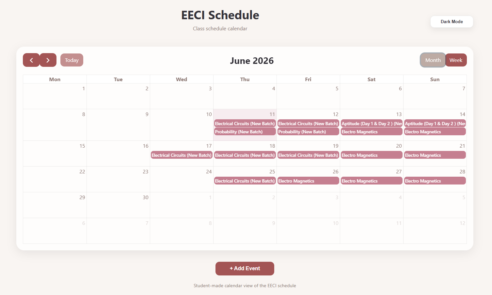
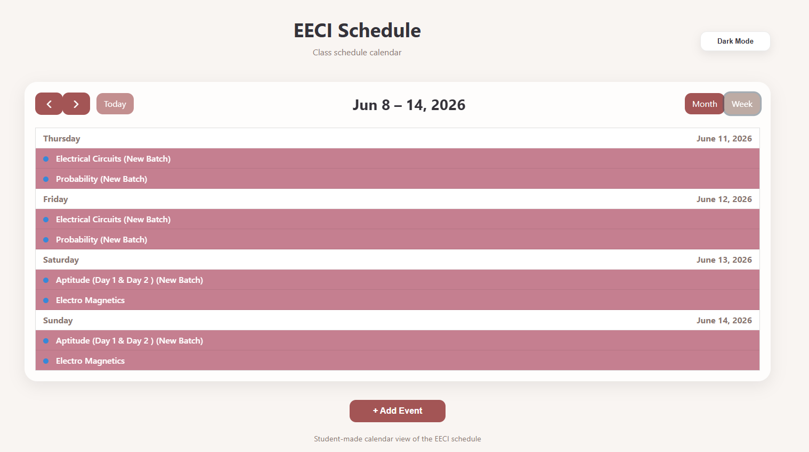
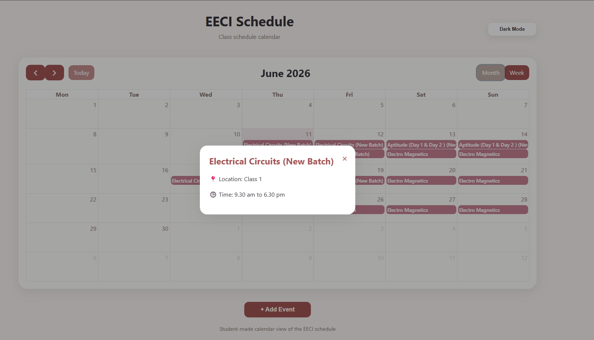
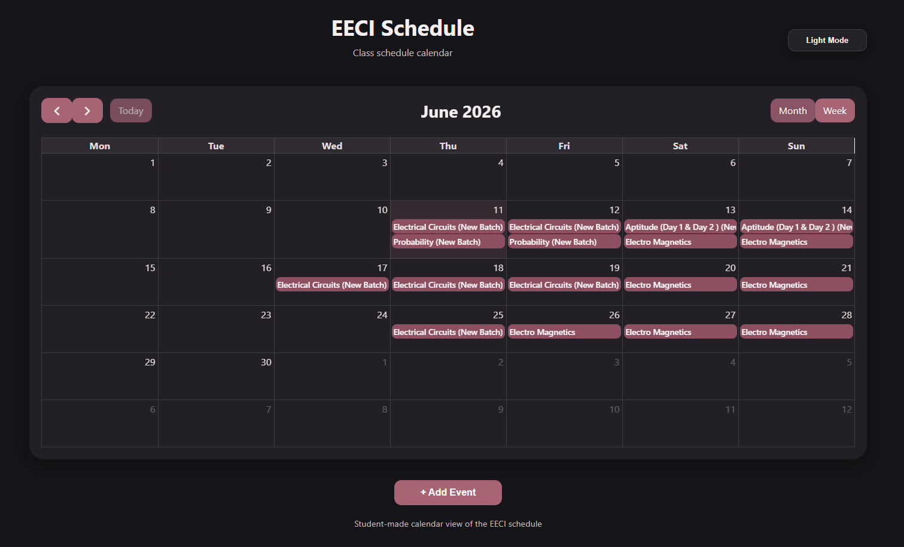

# EECI Schedule Calendar

A Flask-based calendar application for viewing EECI class schedules and managing personal academic events in one place.

Live demo: https://eeci-schedule-calendar.onrender.com/

## Features

- Live EECI schedule extraction from the official EECI schedule page
- Month and weekly list calendar views using FullCalendar
- Monday-first calendar layout
- Dark mode with saved theme preference
- Custom event creation for personal tasks, extra classes, and events
- Notes support for custom events
- Custom event deletion
- Local browser storage for custom events and theme preference
- Graceful fallback if the live EECI schedule cannot be loaded
- Responsive layout for desktop and mobile browsers

## Tech Stack

- Python
- Flask
- BeautifulSoup
- Requests
- HTML
- CSS
- JavaScript
- FullCalendar
- LocalStorage
- Gunicorn
- Render

## Project Structure

```text
eeci-calendar/
|-- app.py
|-- scraper.py
|-- parser.py
|-- events_generator.py
|-- requirements.txt
|-- templates/
|   `-- calendar.html
|-- static/
|   |-- image.png
|   |-- image-1.png
|   `-- image-2.png
`-- tests/
    |-- parser_test.py
    `-- events_generator_test.py
```

## How It Works

1. `scraper.py` fetches the EECI schedule page and reads the schedule table.
2. `parser.py` converts date text such as `JUN'26` and `13th, 14th` into ISO dates.
3. `events_generator.py` builds event objects for FullCalendar.
4. `app.py` passes those events into `templates/calendar.html`.
5. The browser displays live EECI events together with user-created custom events from LocalStorage.

If the live schedule cannot be fetched, the app still opens and shows saved custom events with a friendly warning message.

## Getting Started

### Clone the repository

```bash
git clone https://github.com/aashi20032009-cmyk/eeci-schedule-calendar.git
cd eeci-schedule-calendar
```

### Create and activate a virtual environment

```bash
python -m venv .venv
```

Windows PowerShell:

```powershell
.\.venv\Scripts\Activate.ps1
```

macOS/Linux:

```bash
source .venv/bin/activate
```

### Install dependencies

```bash
pip install -r requirements.txt
```

### Run locally

```bash
python app.py
```

Open:

```text
http://127.0.0.1:5000/
```

## Deployment

This project is configured for deployment on Render.

Recommended Render settings:

- Build command: `pip install -r requirements.txt`
- Start command: `gunicorn app:app`
- Branch: `main`

If changes do not appear after deployment, use Render's manual deploy option and choose `Clear build cache & deploy`.

## Screenshots

Monthly view:



Weekly view:



Event pop-up:



Dark Mode : 



## Current Status

Completed:

- Live EECI schedule calendar
- Month and week/list views
- Custom events
- Notes for custom events
- Delete custom events
- Dark mode with saved preference
- Network-safe fallback when live extraction fails

Planned improvements:

- Edit custom events
- Attendance tracking
- Event filtering
- Import/export schedule data
- Google Calendar integration
- Progressive Web App support

## Author

P Aashi Apuurvaa

GitHub: https://github.com/aashi20032009-cmyk
